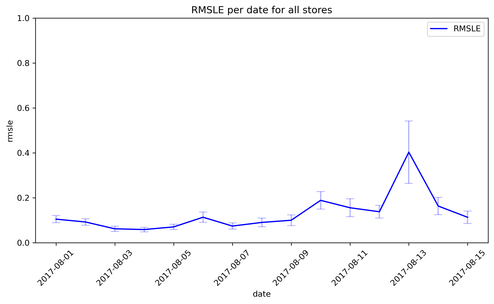

# **Time_Series forecasting**  

Dataset downloaded from [kaggle](https://www.kaggle.com/competitions/store-sales-time-series-forecasting).  

In this project the goal is to predict sales of family of items (33) over a 15 days period for 54 stores.  
The dataset corresponds to a chain of supermarkets in Ecuador.  
The period length is [2013-01-01 to 2017-08-15]. The test dataset corresponds to the next 2 weeks.  
We have to predict sales. As a consequence, we also do not have the predicted transactions (number of clients who bought something).  
Therefore we have to first predict transactions per store and use this information as a helper for item sales.  
Although we transactions are very heterogeneous between stores (with the exception of the christmas period), we found a very strong weekly rhythm.  
However, this rhythm can be disturbed either through its amplitude of oscillations or even a phase shift by holidays or other events. These disturbances are not homegeneous and therefore affects more or less each store transactions.
Using a recursive method, I first predicted transactions. 

The graph above shows the performance of the model to predict transactions. The root mean squared logarithmic error is a good metric for this kind of dataset as it provides more importance for the % of difference and penalises underestimations which is what we want to avoid here as we do not want empty shelves in our stores.
The next step I am currently working on is to predict sales.  
Soon will be posted here the performance for sales.